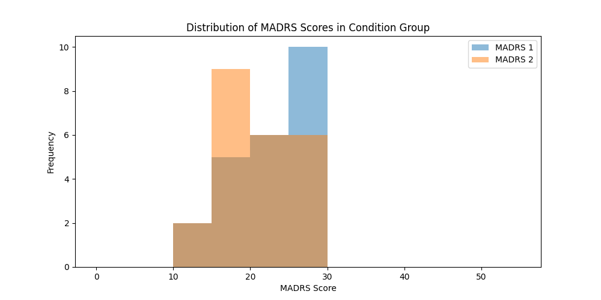
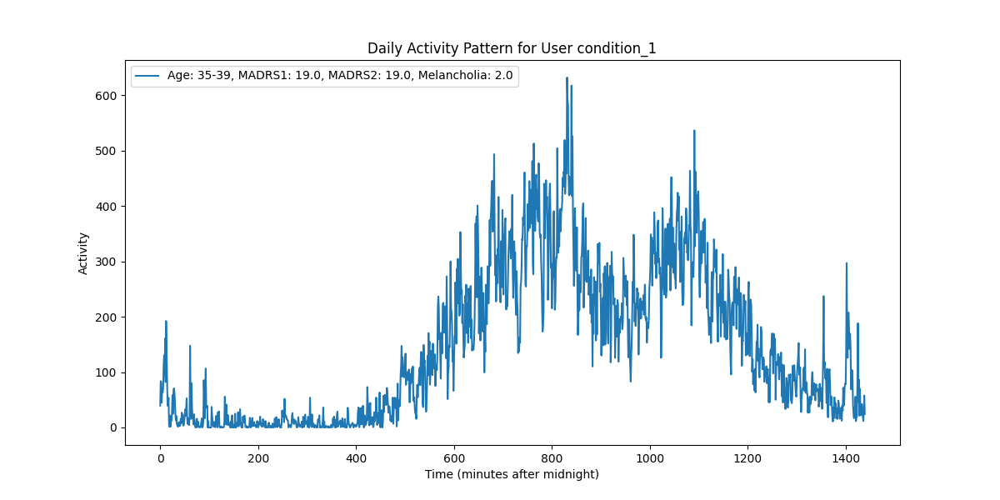
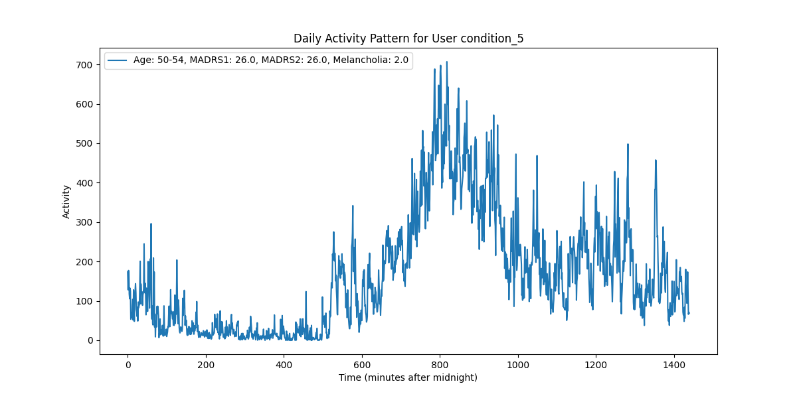
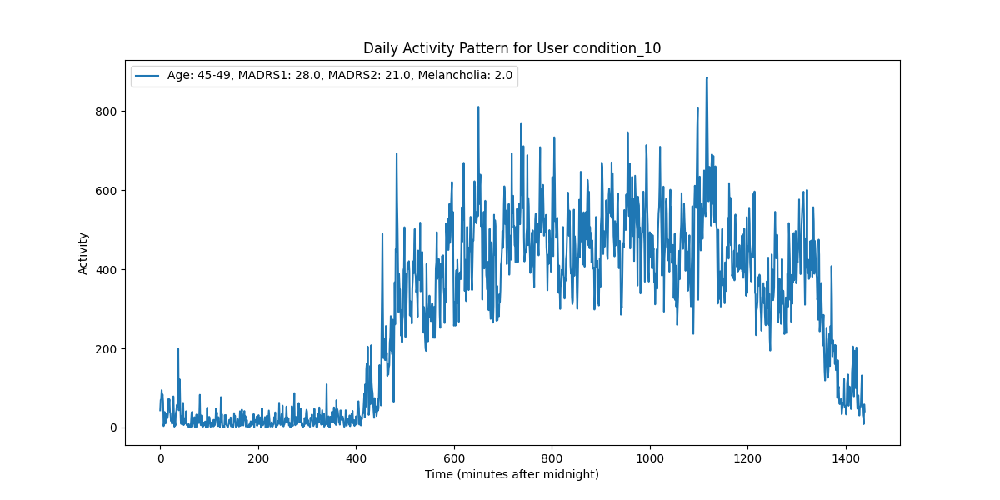
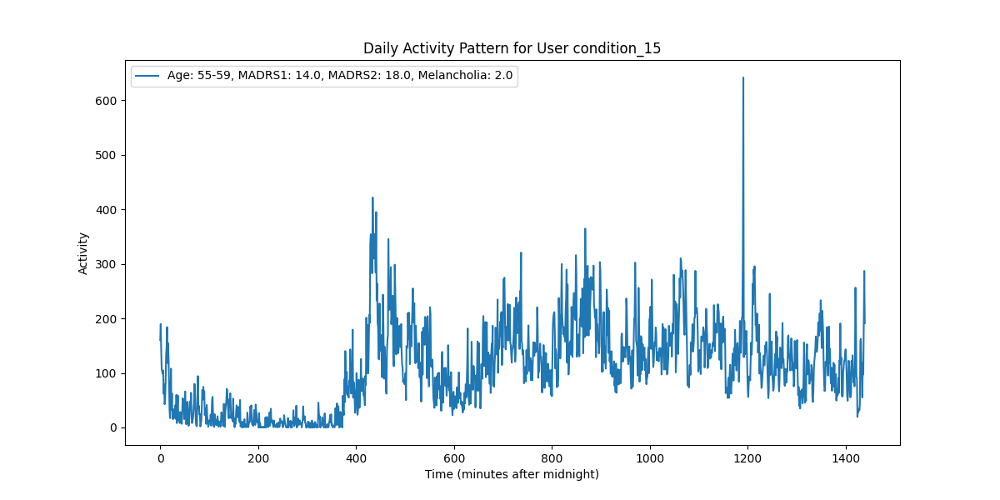
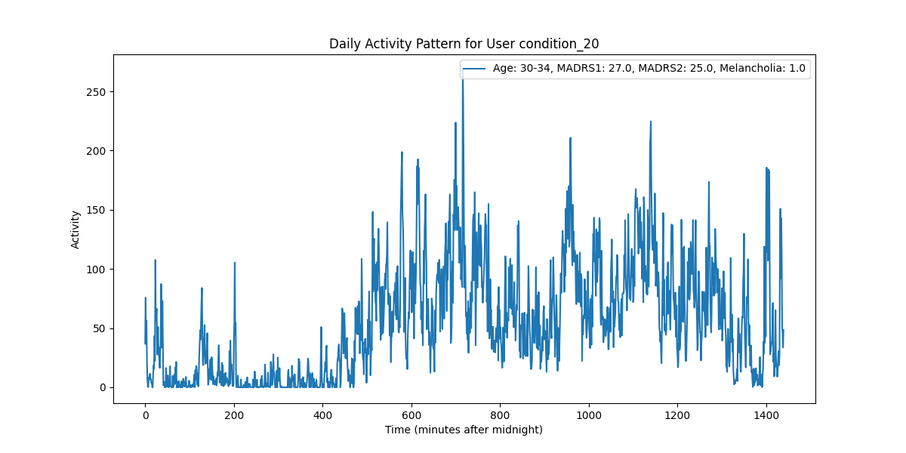
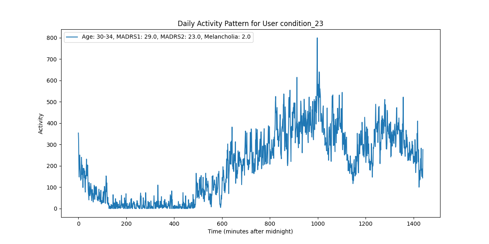

<!-- Readme to describe the project for cs 4701: Practicum in AI. The project is to use sleep data of multiple people collected using actigraph watch to predict the level of depression and the type of depression -->

# Sleep Data Analysis for Depression Prediction

## Team Members

- Pratyush Sudhakar (ps2245)
- Liam Du (ld386)
- Yiming Wang (yw444)

## Introduction

Depression is a severe mental disorder with characteristic symptoms like sadness, the feeling of emptiness, anxiety and sleep disturbance, as well as general loss of initiative and interest in activities. Actigraph recordings of motor activity are considered an objective method for observing depression, although this topic is far from exhaustive studied within psychiatric research.

This project is to predict the level of depression and the type of depression using sleep data collected from multiple people using an actigraph watch.

## Data

The data is from the [Depresjon The Depresjon Dataset](https://datasets.simula.no/depresjon/#dataset-details).The dataset contains motor activity recordings of 23 unipolar and bipolar depressed patients and 32 healthy controls.

The dataset was originally collected for the study of motor activity in schizophrenia and major depression. Motor activity was monitored with an actigraph watch worn at the right wrist (Actiwatch, Cambridge Neurotechnology Ltd, England, model AW4). The actigraph watch measures activity levels. The sampling frequency is 32Hz and movements over 0.05 g are recorded. A corresponding voltage is produced and is stored as an activity count in the memory unit of the actigraph watch. The number of counts is proportional to the intensity of the movement. Total activity counts were continuously recorded in one minute intervals.

## Data Preprocessing

The data preprocessing steps include:

1. Data Cleaning: The data is cleaned by removing any missing values.
2. CSV to JSON: The data is converted from CSV to JSON format.

<!-- images from graphs folder -->

## Data Visualization

### Individuals sleep data for a few users is visualized in the following graphs:

<table>
  <tr>
    <td></td>
    <td></td>
  </tr>
  <tr>
    <td></td>
    <td></td>
  </tr>
  <tr>
    <td></td>
    <td></td>
  </tr>
</table>

## Methodology

The project uses machine learning algorithms to predict the level of depression and the type of depression using the sleep data.

1. Logistic Regression
2. Support Vector Machine
3. Random Forest
4. Gradient Boosting
5. Neural Network

The project evaluates the performance of the machine learning algorithms using metrics such as accuracy, precision, recall, and F1 score. The project also uses cross-validation to evaluate the performance of the machine learning algorithms.
